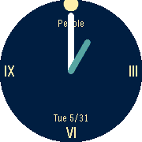

# CupertinoFace
A simple and elegant analog face for Pebble watches with lots of customization options. Built with RockyJS.

## Screenshots

## Supported Models
- Pebble Time
- Pebble Time Steel
- Pebble Time Round
- Pebble 2 (v1.2+)

## Contributors
Making a pull request? If so, be sure to add your name and contribution(s) below for the credit you deserve!

- [crc32](https://github.com/crc-32) - Optimization improvements
